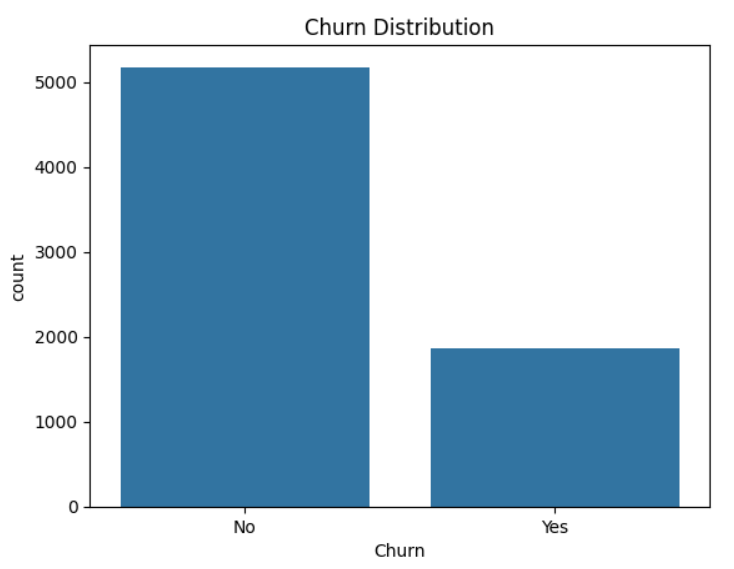
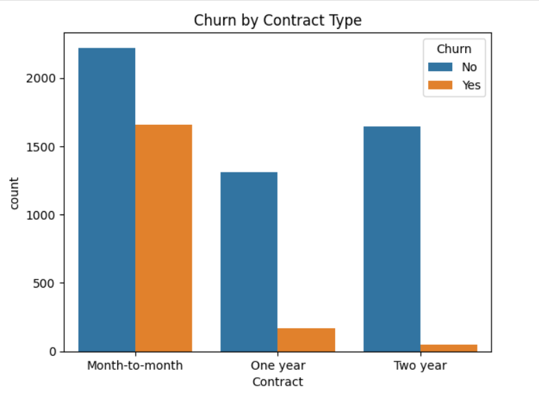
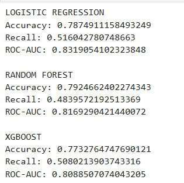

# Customer Churn Prediction

## 📌 Project Overview
Customer churn prediction aims to identify customers who are likely to stop using a service. This project uses a telecom dataset to analyze churn patterns and build machine learning models for prediction.

## 📊 Dataset
- Customer Churn Prediction.csv
- 7043 records, 21 features
- Target variable: Churn (Yes / No)

## 🔍 Exploratory Data Analysis (EDA)
- Churn distribution
- Contract type vs churn
- Tenure vs churn
- Monthly charges vs churn

## 🧠 Models Used
- Logistic Regression
- Random Forest
- XGBoost

## 📈 Evaluation Metrics
- Accuracy
- Recall
- ROC-AUC Score

## 🛠 Technologies Used
- Python
- Pandas, NumPy
- Matplotlib, Seaborn
- Scikit-learn
- XGBoost

## 📸 Project Visuals

- Churn Distribution
- Monthly Charges vs Chur
- Tenure vs Churn
- Churn by Contract Type
- Model Results

- These images has been stored in the folder named images

## 📸 Project Visuals

### Churn Distribution


### Contract vs Churn


### Tenure vs Churn


### Monthly Charges vs Churn


### Model Results
 

## 🚀 How to Run
```bash
pip install -r requirements.txt
python Customer Churn Prediction.py


